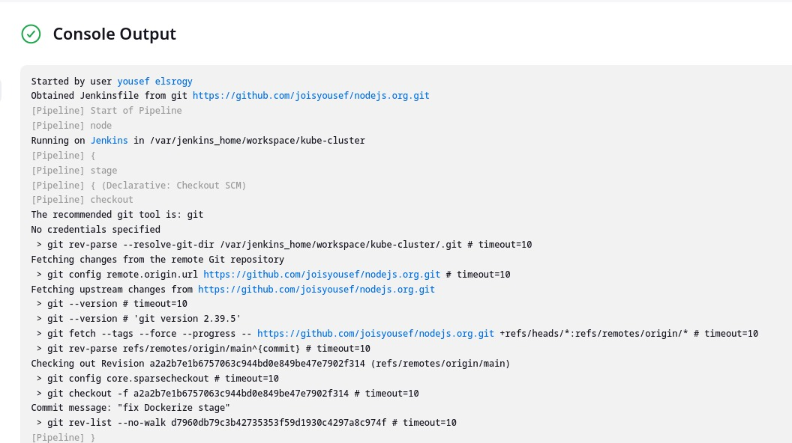
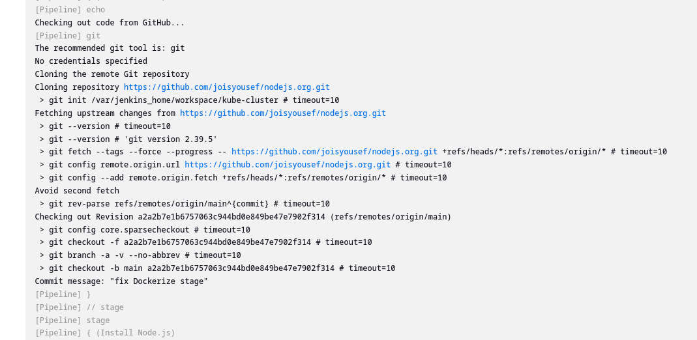

# Overview

#### Node.js Application Deployment with Jenkins, ArgoCD, and Kubernetes

This project demonstrates a CI/CD pipeline for a Node.js application using **Jenkins** for CI, **ArgoCD** for continuous deployment on Kubernetes, and **Docker** for containerization. The pipeline includes steps to automate the build, test, and deployment processes from a GitHub repository to a Kubernetes cluster.

## Prerequisites

- Docker installed on the Jenkins server
- Kubernetes cluster with ArgoCD installed
- GitHub repository with Node.js source code
- GitHub personal access token with repository access

## Technologies Used

- **Node.js & React**: Backend and frontend development.
- **Docker**: Containerize the Node.js application.
- **Jenkins**: Automate the CI/CD pipeline.
- **ArgoCD**: Deploy the application to a Kubernetes cluster.
- **Kubernetes**: Orchestrate containerized applications.

## Installation and Setup

### Step 1: Setup Jenkins

1. **Run Jenkins Container**:

   `docker run -d -p 8080:8080 -p 50000:50000 \ --name jenkins \ -v jenkins_home:/var/jenkins_home \ -v /var/run/docker.sock:/var/run/docker.sock \ jenkins/jenkins:lts`

2. **Install Dependencies**:

   - Install Node.js and Docker on the Jenkins container to support building and running the application.
   - Install Kubernetes CLI (kubectl) and Minikube as needed for local cluster setup.

3. **Configure Jenkinsfile**: Set up a `Jenkinsfile` in the root directory to define the pipeline stages, including installing dependencies, testing, Dockerizing the app, and deploying it to the cluster.

### Step 2: Configure ArgoCD for Deployment

1. **Add Your Repository to ArgoCD**:

```
kubectl create namespace argocd
kubectl apply -n argocd -f https://raw.githubusercontent.com/argoproj/argo-cd/stable/manifests/install.yaml

kubectl -n argocd get secret argocd-initial-admin-secret -o jsonpath="{.data.password}" | base64 -d; echo


kubectl port-forward svc/argocd-server -n argocd 8080:443
```

2. **Create Application in ArgoCD**:

   - Set up a new ArgoCD application, specifying the Git repository, target revision, and Kubernetes cluster destination.

3. **Deployment YAML Files**:

   - Define Kubernetes YAML manifests for deployments, services, and config maps. ArgoCD will use these files to manage the application state on the cluster.

### Step 3: Pipeline Execution in Jenkins

1. **Install Plugins**:

   - Install the necessary Jenkins plugins, including Docker, Kubernetes CLI, and GitHub integration plugins.

2. **Run the Pipeline**:

   - Trigger the pipeline in Jenkins. Stages include:
     - **Install Dependencies**: Installs `npm` dependencies for frontend and backend.
     - **Run Unit Tests**: Executes tests to verify the application's functionality.
     - **Dockerize App**: Builds a Docker image and tags it.
     - **Push to Docker Hub**: Pushes the image to Docker Hub.
     - **Deploy with ArgoCD**: Applies Kubernetes manifests for deployment.

## Usage

1. **Local Development**:

   - Run the client and server locally using `npm start` within each folder.

2. **Build and Deploy**:

   - Run the Jenkins pipeline to build, test, and deploy the application.
   - Check the application status in ArgoCD to confirm the deployment.

## Troubleshooting

- **Jenkins Docker Permission Error**: Ensure Docker daemon is accessible within the Jenkins container by mounting `/var/run/docker.sock`.
- **ArgoCD Repository Access Issues**: Confirm that the GitHub repository token has sufficient access and the repository URL is correct.
- **Pipeline Timeout**: Check network stability and increase buffer size if the repository is large.

jenkins pipeline







on Dockerhub


on Argocd


